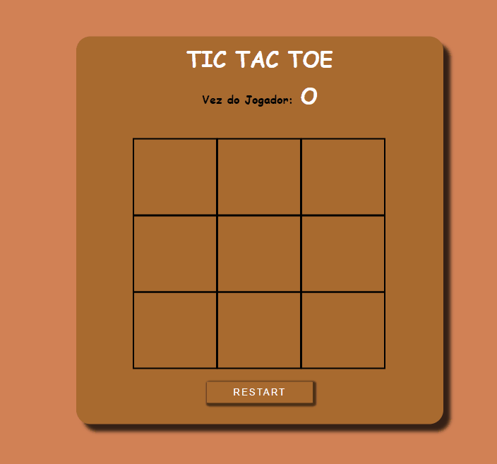

## Jogo da Velha - TicTacToe
### Desenvolvido com HTML, CSS e JS.

    
    
    

### Neste projeto foi desenvolvido o jogo TicTacToe também conhecido como jogo da velha.

### Durante a criação deste projeto, pude desenvolver meus conhecimentos com listas, objetos, verificações entre outros.

### Neste game é necessário dois jogadores, que irão realizar suas jogadas utilizando o mouse. 

 
    

